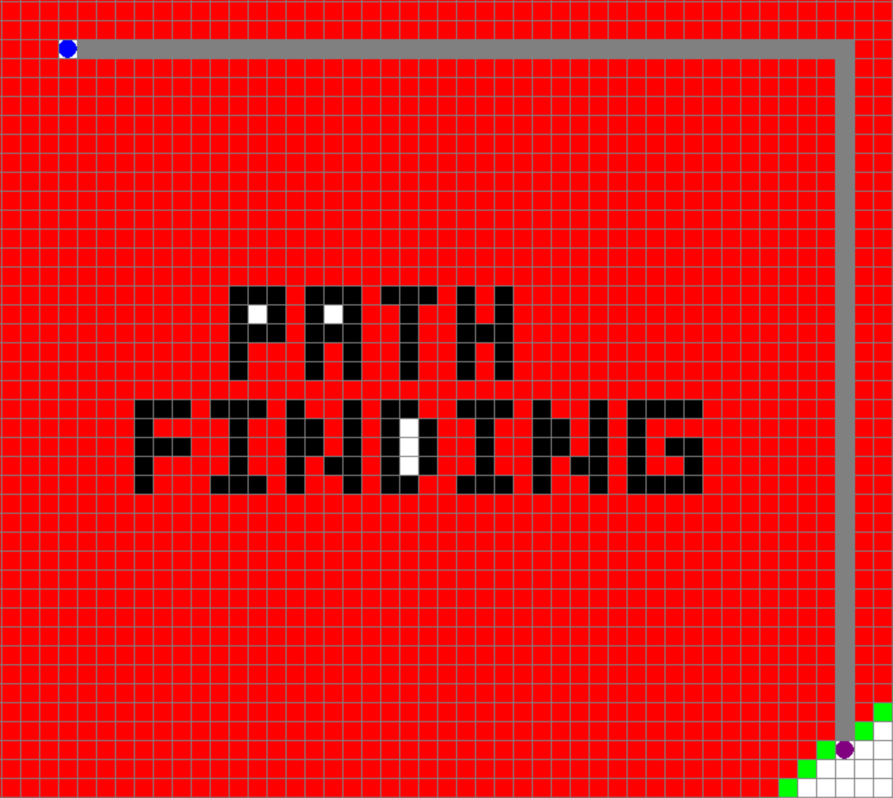

<br />
<p align="center">
  <a href="https://github.com/kdqdev/pathfinding-visual">
    
  </a>

  <h1 align="center">Pathfinding Visualization - A* and Breadth First Search</h1>

  
</p>


## About The Project

<p align="center">
  <a href="https://github.com/kdqdev/pathfinding-visual">
    
  </a>


  
</p>

The project was created to help visualize the breadth first search and A* algorithm on python(using the pygame module).
<br /><br /><br />

## Controls

</br>
Keyboard

> Backspace: Return back to the main menu of the program.

> C: Clears/resets the entire board to white.

> Enter/Return: Selects an option in the main menu.

> Space: After selecting a algorithm to visualize, space will start the program. Only starts, if start/end point is selected.

### Mouse

> Right-Click: Deletes the square that you click on.

> Left-Click: Selecting a square to be a start/end/wall square. If there is no start/end, those square will automatically be placed before the walls.

### Colored Squares
> Blue: starting point
> Purple: ending point
> Grey: path found
> Black: block off path(wall)
> Green: Open Square
> Red: Closed Square

<br>
</br>
<br>
</br>

## Video Example

Video Link: [https://drive.google.com/file/d/1mbQ3cUZjhs9Z0FZBiX4jC8Sndu7uMfau/view?usp=sharing](https://drive.google.com/file/d/1mbQ3cUZjhs9Z0FZBiX4jC8Sndu7uMfau/view?usp=sharing)

<br>
</br>
<br>
</br>


<!-- GETTING STARTED -->
## Getting Started

To get started, just download the the .zip file of the repository or clone it. All packages/dependencies are combined into the .exe/unix file.

### Installation

1. Click on "Code" and then "Download Zip" and unzip the files
   ```sh
   https://github.com/kdqdev/pathfinding-visual
   ```
2. Under the folder "run", click on windowx64 or macos depending on your platform.
3. For macos, right click the run-macos unix executable file and then open.
4. For window, click on start.exe.
5. The application will take a couple seconds to open and start. 

<br>
<br>
<br>

## Common Error

1. Double clicking on the run-macos unix application will result in a "developer not trusted error." To fix this, make sure to right click, and then click "Open".

2. Program doesn't start because the font file "arcadefont.TTF" has to be renamed to "arcadefont.ttf"

<br>
<br>
<br>

<!-- CONTACT -->
## Contact


Project Link: [https://github.com/kdqdev/pathfinding-visual](https://github.com/kdqdev/pathfinding-visual)


